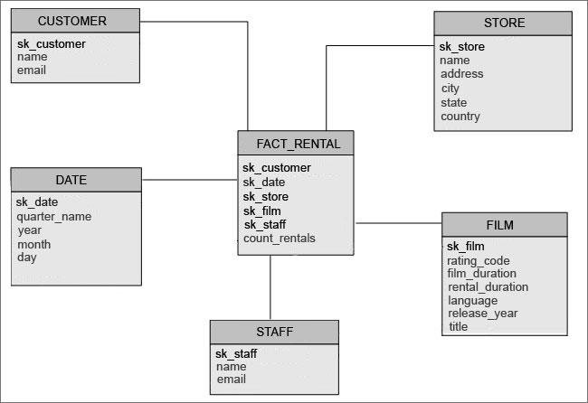

# DSSA Data Gathering & Warehousing

**Instructor**: Carl Chatterton
**Term**: Fall 2021
**Module**: 2
**Week**: 6

---
## ETL with Databases and Python

---

### Introduction
__Extract, Transform & Load__ (ETL) is a process that extracts, transforms, and loads data from one or multiple sources to a __data warehouse__ or other unified data repository.

The following repository contains instructions for connecting to a PostgreSQL database called `dvdrental` and writing your own ETL to create a __star-schema__ in the Data Warehouse (called dw) for the first Lab Assignment

<u>__This is both a lab & a research project__</u>, SQLAlchemy is a massive python library with many modules. In order to complete this lab you will need to research and read the documentation for this library. Reading software documentation often feels like reading the owners manual of a car, but is a necessary part of good software development practices. 

### About the DVD Rental Database
The DVD rental database represents the business processes of a DVD rental store as an OLTP PostgreSQL DB. 
> The DVD rental database has many objects including:
>15 tables
>1 trigger
>7 views
>8 functions
>1 domain
>13 sequences

15 tables in the DVD Rental database:

> * actor – stores actors data including first name and last name.
> * film – stores film data such as title, release year, length, rating, etc.
> * film_actor – stores the relationships between films and actors.
> * category – stores film’s categories data.
> * film_category- stores the relationships between films and categories.
> * store – contains the store data including manager staff and address.
> * inventory – stores inventory data.
> * rental – stores rental data.
> * payment – stores customer’s payments.
> * staff – stores staff data.
> * customer – stores customer data.
> * address – stores address data for staff and customers
> * city – stores city names.
> * country – stores country names.

__Entity Relationship Diagrams__ - An entity relationship diagram (ERD) shows the relationships of entity sets stored in a database. An entity in this context <u>is an object </u>, a component of data. 

By defining the entities, their attributes, and showing the relationships between them, an ER diagram illustrates the logical structure of databases.

The __DVD Rental Database ERD__ can be found in the `docs` folder of this repository as a PDF

---

### Objectives
The main objective of this lab is to implement an ETL process in python to create a __Star-Schema__ in a Data Warehouse that looks like the following:



Put simply, we need to:
1. _extract_ data from a OLTP database called `dvdrental`
2.  _transform_ it by creating an aggregation of the count of rentals
3. _load_ the data into the `dw` Data Warehouse


__A walk-through of each table__

__Fact Table: FACT_RENTAL__
- `sk_customer` is the `customer_id` from customer table 
- `sk_date` is `rental_date` from the rental table
- `sk_store` the `store_id` from the store table
- `sk_film` is the `film_id` from the film table
- `sk_staff` is the `id` from the staff table
- `count_rentals` A count of the total rentals grouped by all other fields in the table
 
__Dimension Table: STAFF__
- `sk_staff` is the `id` field from the staff table
- `name` a concatenation of `first_name` and `last_name` from the staff table
- `email` is the `email` field from the staff table


__Dimension Table: CUSTOMER__
- `sk_customer` is the `customer_id` from customer table
- `name` is the concatenation of `first_name` & `last_name` from the customer table
- `email` is the customer's email 

__Dimension Table: DATE__
- `sk_date` is unique `rental_date` used as a primary key
- `quarter` is a column formatted from `rental_date` for quarter of the year
- `year` is a column formatted from `rental_date` for year
- `month` is a column formatted from `rental_date` for month of the year
- `day` is a column formatted from `rental_date` for day of the month

__Dimension Table: STORE__ 
- `sk_store` the `store_id` from the store table
- `name`  is a concatenation of `first_name` & `last_name` from the staff table
- `address` is the `address` field from the address table
- `city` is the `city` field from the city table
- `state` is the `district` field from the address table
- `country` is the `country field from the country table

__Dimension Table: FILM__
- `sk_film` is the `film_id` from the film table
- `rating_code` is the `rating` field from the film table
- `film_duration` is the `length` field from the film table
- `rental_duration` is the `rental_duration` from the film table
- `language` is the `name` field from the language table
- `release_year` is the `release_year` from the film table
- `title` is the `title` field from the film table
 
---

## Instructions

In our repository we need to do the following:
#### 1. Create the engine and session objects in the `database` directory as a `.py` file
- Use the `launch.json` file in `.VScode` directory to store all environment variables used to connect to the databases.
-  <u>__It is an automatic FAILED GRADE if you push database credentials to gitHub__</u>

#### 2. Define the schema, tables, fields, and relationships using `SQLAlchemy` in the `models` directory as `.py` files. 
- Database schema defines the structure of a database system, in terms of tables, columns, fields, and the relationships between them. 
- The schema name for the data warehouse is your team name. For example `team_1.some_table`
- The name for table names needs to designate which objects are `dimensions` vs `facts`. Example: `team_1.dim_customer` or `team_1.fact_sales`
- The table definition needs to be identical to the source data in the OLTP Database. Example if customer.name is `VARCHAR(50)` in the OLTP database, it needs to be the same in the data warehouse
  
#### 3. Create an ETL Pipeline Script called `main.py` in the `app` directory that has the following functions:
- __setup()__: should initializes database sessions, and create all the schema, tables, fields, and relationships defined in your bases models from the previous step.
- __extract()__: should read from the desired database. You are responsible for setting the arguments of the function and determining what type of object should be returned. 
- __transform()__: You can define any number of transformation related functions to accomplish the task using any arguments you come up with. Remember it is often better to debug if we isolate certain aspects of our data transformations.  
- __load()__: should insert data to the target database (the data warehouse). Again, you have the freedom to determine your own arguments to accomplish this task
- __teardown()__: Should close any active sessions and open connections to the database. 

## Environment Setup
#### 1. Create a new virtual environment

Using `Pipenv`
```python
# Create your virtual enviroment with Pipenv
pipenv --python 3.8
# Access Pipenv Virtual Environment
pipenv shell
```
Using `Conda`
```python
# Using Conda to create your virtual environment
conda create -n <your_environment_name> python=3.8
# Accessing Conda Virtual Environment
conda activate <your_environment_name>
```
#### 2. Install dependencies from the `requirements.txt` file
```python
# using pip
pip install -r requirements.txt

# using pipenv
pipenv install -r requirements.txt

# using conda
conda install --file requirements.txt
```

#### 3. Create environment variables & store them in the launch.json file
Insert environment variables by adding `"env"` to the `configuration` json

__Note__ storing environment variables will require you to run scripts in debugger mode only.

Example of adding environment variables
```json
"env" : {
    "<INSERT_VARIABLE1>" : "<INSERT_VALUE>",
    "<INSERT_VARIABLE2>" : "<INSERT_VALUE>",
    "<INSERT_VARIABLE3>" : "<INSERT_VALUE>",
    }
```
#### 4. Read the Python Library Documentation
[SQLAlchemy](https://docs.sqlalchemy.org/en/14/) - This is a must
[Pandas](https://pandas.pydata.org/docs/) - This is optional, but may simplify your pipelines and provides SQLalchemy support for databases and I/O. 

#### 5. Download the POSTGRES Explorer Extension in VScode
Called `PostgreSQL` - PostgreSQL Management Tool
This will allow you to view tables in the OLTP database and run some simple queries to explore the data. 
__Note__: this is a query tool and not a database administration tool, its purpose is to see your tables and execute queries


